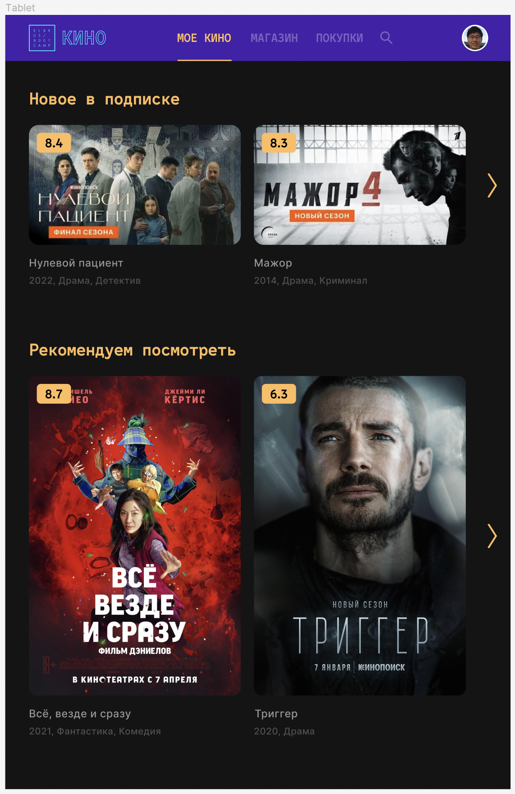

## CSS-@media

### Введение

В прошлый раз ты разработал отличный сайт! Можешь по вечерам смотреть на нём кино, или, например, наши лекции! Вот только что делать, если ты захочешь посмотреть кино со своего смартфона? Попробуй открыть свой сайт в узком окне. Скорее всего часть верстки сломается, а что-нибудь уедет за грань окна, придётся пользоваться горизонтальным скроллом, чтобы листать фильмы. Так? Ну неудобно ведь! Тут тебе приходят на помощь `@media-запросы`. Тебе надо `сверстать страницу под разные разрешения` по [макету](https://www.figma.com/file/FERa1znzWOYXVQ0hASDDiQ/ECB-Phase-0-tasks-Tablet-Mobile-share) :fire:   

### Релиз 0. Продумай всё.

Что именно ты хочешь сделать? Как будет выглядеть сайт на смартфоне? А если взять планшет? Для ориентира посмотри на рисунок ниже:

_Рисунок 1. Пример адаптивного сайта ElbrusKino._

### Релиз 1. За работу!

Пора разобраться с `media-запросами`. Скопируй свой кино-сайт в этот репозиторий и сделай его адаптивным. Используй `max-width`, `min-width`, `flex-wrap` и всё у тебя получится!

*И наконец, не забудь сделать "Pull request" своего проекта прежде, чем приступать к следующему заданию.*
